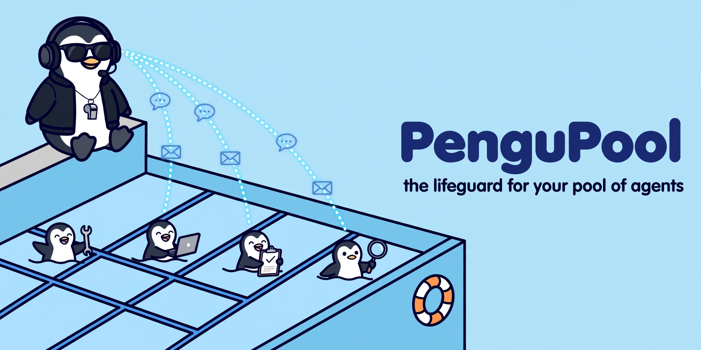
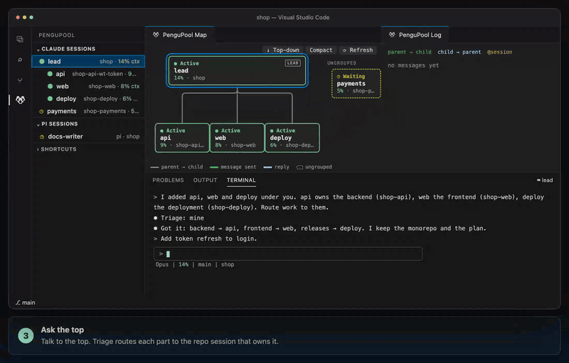

<p align="center">
  
</p>

<h1 align="center">PenguPool</h1>

<p align="center"><b>The lifeguard for your pool of agents.</b></p>

Your agents are the pengus: Claude Code and pi sessions, each swimming its own lane in its own repo or
worktree, passing work to one another and working together in sync. PenguPool is the tool that manages
the pool. It watches every lane from VS Code/Cursor, backed by a local Python CLI: the session tree, a
live map of who is talking to whom, recent messages, and a tmux-backed terminal per harness. It also
keeps the lanes in order: a grouped session messages only its parent or its direct children, so work
moves down the tree and results come back up. Sessions run in tmux and keep swimming when you close
the front end.



## Tutorial

Watch [PenguPool Tutorial: Build an AI Agent Team Across Repos with pi](https://www.youtube.com/watch?v=CogDOQckpGU&t=31s) — a full demo of grouping a director with workers, routing work down the tree, and following every handoff in the map and log.

## Install

One command installs the latest release: the `pengupool` CLI, the wiring for every installed harness (Claude Code, pi), the workflow tracker, and the extension in every VS Code and Cursor it finds.

```sh
curl -fsSL https://pengupool.nduwork.com/install.sh | bash
```

It needs Python 3.11+ and Make, installs [uv](https://docs.astral.sh/uv/) if missing, and offers tmux 3.2+ and the agent CLIs (y/N each). `PENGUPOOL_REF=vX.Y.Z` pins a release; `HARNESS=cc|pi|both` and `EDITOR_CLI=code|cursor` override detection. From a checkout, `bash install.sh` installs that tree.

From a checkout, Make covers the same steps:

```sh
git clone https://github.com/nduwork/pengutool.git
cd pengutool
make install        # CLI, harness wiring, tracker (HARNESS=auto|cc|pi|both)
make ext-deps       # once, to build the extension (needs Node.js/npm)
make install-all    # backend + extension (EDITOR_CLI=code|cursor to choose)
```

`make check-install` reports what is missing. `make uninstall-all` removes the extension, hooks, tracker and CLI; session transcripts, worktrees and saved grouping data are kept. Reload the editor window after installing or updating.

## Use

Open the PenguPool view (penguin icon in the Activity Bar). Claude Sessions lists your Claude Code sessions. A Pi Sessions view appears while both Claude Code and pi sessions are running, and the Map and Log then get a Claude Code | pi tab each. Select a session to show it in the PenguPool terminal; the Map and Log panels show the selected tree. The Shortcuts panel under the sessions is a cheat sheet of the keys below.

| Key | Action |
| --- | --- |
| `Enter` / click | Open a session in the terminal; its folder is revealed in the Explorer when this window has it (`pengupool.explorerFollow` turns that off) |
| `n`, `a` | Start a session (in the folder or a new worktree) or add a previous one |
| `g` / drag | Group under another session |
| `r`, `d` | Rename a session, or describe its role |
| `x`, `c` | Close or compact a session |
| `Shift+R` | Restart & resume, e.g. after a Claude Code or pi update |
| `Shift+Enter` | New line in a Claude Code prompt, in the PenguPool terminal |
| right-click | All session actions, including Reveal in Finder and Describe Role; the map offers the same menu on its nodes |

After a reboot, or any time the tmux server is gone, **Resume Previous Sessions…** (the run-all button
in the Sessions title, or right-click → the same) rebuilds the pool: it lists every session PenguPool
can still resume with its folder and last activity, and puts the ticked ones back on the server.

See the [guide](docs/guide.md) for how to brief a pool and keep work routed well.

Grouped sessions receive a short `<pengupool>` block with their tree, parent, children and role. Routing is enforced: a grouped session may message only its parent or direct children (Claude Code through a `PreToolUse` guard, pi through the bundled extension and pi-intercom), and `pengupool ctl route <id> <target>` names the next hop. Tag a session in your prompt (`@reviewer …`) to let the session you typed into message it directly until your next prompt.

Triage gets a hint from code. When a prompt matches a child's routing keywords (`pengupool ctl describe <id> --keywords "lexer, parser"`), name, workspace or role, the session is told `ROUTE CHECK` with the words that matched, and decides whether to route. A session with no role is told `ROLE REQUIRED`. Messages from other sessions, idle notices and subagent reports never trigger the check. Each grouped reply starts with a `Triage:` line, and "do it yourself" in a prompt turns the check off for that prompt.

PenguPool reads local Claude Code and pi session files and keeps its own state under `~/.pengupool/`. It does not need a cloud account or hosted service. The bundled [workflow tracker](workflow-tracker/SKILL.md) keeps one workflow chain per session and shows its current phase under the session's map card.
The [pool-groups](pool-groups/SKILL.md) skill proposes a change to the session tree when you ask for one. Nothing
moves until you apply it: the proposal shows as a banner on the map and a notification, each with Apply and
Discard, and a session can never apply one itself.

## Develop

```sh
make ext-deps       # once per clone or worktree: installs extension/node_modules
make test           # uv run pytest -q, then the extension tests
make ext-compile    # build the extension
```

`pengupool` with no arguments lists the commands. `pengupool serve` streams NDJSON snapshots for the extension (`--once` prints one). `pengupool ctl` lists the control verbs the editor and pi extensions call. To propose a change, use a fork and pull request; see [CONTRIBUTING.md](.github/CONTRIBUTING.md).

## Releasing

A release is a tag. `scripts/release.sh` bumps `pyproject.toml` from conventional commits, promotes `## [Unreleased]` in `CHANGELOG.md`, tags `vX.Y.Z` and pushes; the release workflow then tests, builds the wheel and `pengupool.vsix`, and publishes the GitHub Release. One tag ships a matching backend and extension: the tag is the backend version, and the extension's own version moves only when `extension/` changed. `scripts/release-status.sh` shows what has landed and whether a release is warranted; docs/chore-only changes do not need one.

## Limits

PenguPool supports macOS/Linux and requires tmux. Adopting a running session from outside PenguPool stops that process and resumes it from its transcript, so wait for the current turn to finish. Context percentages appear only when the agent reports them. The message guard applies to supported agent messaging tools, not every possible external communication channel.
