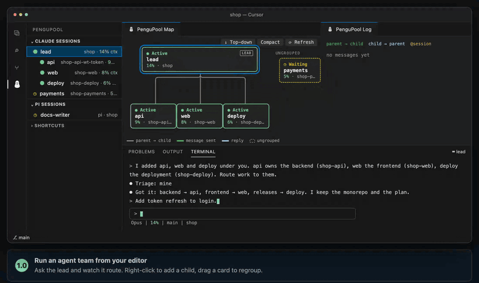

<p align="center">
  
</p>

<p align="center">Run a team of Claude Code and pi agents from your editor.</p>

<p align="center">
  <a href="https://github.com/nduwork/pengupool/actions/workflows/ci.yml"></a>
  <a href="https://github.com/nduwork/pengupool/releases/latest"></a>
  <a href="LICENSE"></a>
</p>

<p align="center">
  <a href="https://pengupool.nduwork.com">Website</a> ·
  <a href="docs/guide.md">Guide</a> ·
  <a href="https://www.youtube.com/watch?v=CogDOQckpGU&t=31s">Video tutorial</a> ·
  <a href="CHANGELOG.md">Changelog</a>
</p>



Your agents are the pengus: Claude Code and pi sessions, each swimming its own lane in its own repo or
worktree. PenguPool manages the pool from VS Code or Cursor. You arrange the sessions as a tree, talk to
the one at the top, and it routes each part of the work to the session that owns it, while the map shows
who is messaging whom. Sessions run in tmux, so they keep working when you close the editor.

## Features

- **A session tree you arrange by hand**: drag a row in Sessions or a card on the Map onto its new parent,
  or right-click a session to add a child. The tree is what every session sees.
- **Enforced routing**: a grouped session may message only its parent and its direct children. Claude Code
  is held to it by a `PreToolUse` guard, and pi by the bundled extension. `@session` in a prompt opens a
  one-off direct line.
- **Triage with a hint from code**: each session has a role and routing keywords. When a prompt matches a
  child, the session is told `ROUTE CHECK` and decides whether to route it, and every reply starts with a
  `Triage:` line.
- **A live Map and Log**: lines light green when a parent messages a child and blue for the reply. Each card
  shows the session's state, context use and current workflow phase.
- **One terminal per harness**: tmux-backed, so a session survives the editor. Restart in place after an
  update (`Shift+R`), compact (`c`), or give a Claude Code session a fresh context that keeps its place in
  the tree (`Shift+C`).
- **Rebuild after a reboot**: **Resume Previous Sessions…** puts every session you tick back on the tmux
  server, in its folder and its group.
- **Skills that ship with it**: a workflow tracker, a regrouping proposer, and **skill-repo**, which offloads
  what you know about a task into a new repo built to carry it.
- **Local only**: PenguPool reads the agents' own session files and keeps its state under `~/.pengupool/`.
  There is no account and no hosted service.

## How it works

One Python backend holds the model: the sessions, the tree, the roles and the message log. Three front ends
plug into it, one for each place you meet your agents.

```text
     VS Code / Cursor              Claude Code               pi
 ┌──────────────────────┐  ┌──────────────────────┐  ┌──────────────────────┐
 │  editor extension    │  │  hooks + guard       │  │  pi extension        │
 │  Sessions · Map ·    │  │  <pengupool> block,  │  │  tree block,         │
 │  Log · terminal      │  │  SendMessage guard   │  │  pi-intercom guard   │
 └──────────┬───────────┘  └──────────┬───────────┘  └──────────┬───────────┘
            │ pengupool serve (NDJSON) │ lifecycle hooks          │ pengupool ctl
            │ pengupool ctl            │ (pengupool.context,      │
            │                          │  pengupool.routing)      │
            └──────────────────────────┼──────────────────────────┘
                                       ▼
                        ┌──────────────────────────────┐
                        │  pengupool (Python CLI)      │
                        │  model · routing · profiles  │
                        │  state in ~/.pengupool/      │
                        └──────────────┬───────────────┘
                                       ▼
                     tmux: one server per harness, one pane per session
```

| Piece | What it does |
| --- | --- |
| `pengupool serve` | Streams NDJSON snapshots of the pool to the extension, which only renders. |
| `pengupool ctl` | The control verbs (new, resume, group, describe, route, …) called by the editor and the pi extension. |
| Claude Code hooks | `pengupool.context` injects the `<pengupool>` block (tree, parent, children, role) on each prompt; `pengupool.routing` guards `SendMessage`. Both are registered by `pengupool setup`. |
| pi extension | The same block in pi's system prompt, and the same rule for pi-intercom `send` / `ask`. |

## Install

One command installs the latest release: the `pengupool` CLI, the wiring for every installed harness
(Claude Code, pi), the bundled skills, and the extension in every VS Code and Cursor it finds.

```sh
curl -fsSL https://pengupool.nduwork.com/install.sh | bash
```

It needs Python 3.11+ and Make, installs [uv](https://docs.astral.sh/uv/) if missing, and offers tmux 3.2+
and the agent CLIs (y/N each). `PENGUPOOL_REF=vX.Y.Z` pins a release; `HARNESS=cc|pi|both` and
`EDITOR_CLI=code|cursor` override detection. Reload the editor window after installing or updating.

<details>
<summary>From a checkout</summary>

```sh
git clone https://github.com/nduwork/pengupool.git
cd pengupool
make install        # CLI, harness wiring, tracker, skills (HARNESS=auto|cc|pi|both)
make ext-deps       # once, to build the extension (needs Node.js/npm)
make install-all    # backend + extension (EDITOR_CLI=code|cursor to choose)
```

`make check-install` reports what is missing. `make uninstall-all` removes the extension, hooks, tracker,
skills and CLI; session transcripts, worktrees and saved grouping data are kept.
</details>

## Quick start

1. **Add the agents.** Open the PenguPool view (the penguin in the Activity Bar) and press `n` for each one:
   pick its repo, then the folder itself or a new worktree, then the harness.
2. **Put a lead over them.** Drag each agent onto the lead, or right-click the lead → **New Child Session**.
   Tell the lead what each child owns. Each session records its own role, and `d` edits it.
3. **Talk to the lead.** It routes each part to the child that owns it. Watch the lines light up on the Map
   and the messages arrive in the Log.

The [guide](docs/guide.md) covers how to brief a pool and keep work routed well.

## Use

The **Claude Sessions** view lists your Claude Code sessions as a tree. A **Pi Sessions** view appears while both
harnesses run, and the Map and Log then get a Claude Code | pi tab each. Selecting a session shows it in the
PenguPool terminal, and the Map and Log follow the selected tree. The **Shortcuts** panel is a cheat sheet of
these keys:

| Key | Action |
| --- | --- |
| `Enter` / click | Open the session in the terminal and reveal its folder in the Explorer (`pengupool.explorerFollow` turns that off) |
| `n`, `a` | Start a session (in the folder or a new worktree) or add a previous one, at the top level |
| `g` / drag | Group under another session: drag a row in Sessions or a card on the Map, or drop on empty space for the top level |
| `r`, `d` | Rename the session, or describe its role |
| `x`, `c` | Close or compact the session |
| `Shift+C` | Fresh context (`/clear`) for a Claude Code session; it keeps its place in the tree and its role |
| `Shift+R` | Restart & resume in place, e.g. after a Claude Code or pi update |
| `Shift+Enter` | New line in a Claude Code prompt, in the PenguPool terminal |

**Right-click** a session, in Sessions or on the Map, for every action in one menu:

- New Child Session…, Add Previous Session as Child…, Resume Previous Sessions…
- Reveal in Finder, Copy Path
- Compact, Fresh Context, Restart & Resume
- Group Under…, Rename, Describe Role…
- Close

Right-click empty space to add a session at the top level.

**After a reboot**, or whenever the tmux server is gone, **Resume Previous Sessions…** (the run-all button in
the Sessions title) lists every session PenguPool can still resume, with its folder and last activity, and
puts the ticked ones back.

### Routing and roles

- Each grouped session gets a short `<pengupool>` block with its tree, parent, children and role.
- It may message only its parent or its direct children. `pengupool ctl route <id> <target>` names the next
  hop for anything further.
- Tag a session in a prompt (`@reviewer …`) to let the session you typed into message it directly until your
  next prompt.
- When a prompt matches a child's routing keywords (`pengupool ctl describe <id> --keywords "lexer, parser"`),
  name, workspace or role, the session is told `ROUTE CHECK` with the words that matched. A session with no
  role is told `ROLE REQUIRED`. Messages from other sessions, idle notices and subagent reports never trigger
  the check, and "do it yourself" in a prompt turns it off for that prompt.

## Skills

`make install` (and so the installer) puts these in place for each harness it wires: Claude Code skills in
`~/.claude/skills`, pi skills and extensions in `~/.pi/agent`.

| Skill | Harness | Ask for it with | What it does |
| --- | --- | --- | --- |
| [workflow-tracker](workflow-tracker/SKILL.md) | Claude Code (status line + hooks), pi (skill + extension) | (always on) | Keeps one workflow chain per session and shows its current phase under the session's map card. |
| [pool-groups](pool-groups/SKILL.md) | pi | "group my sessions" | Proposes a new session tree. Nothing moves until you click Apply on the map banner or the notification; a session can never apply one itself. |
| [skill-repo](skill-repo/SKILL.md) | Claude Code, pi | "offload my knowledge about X to a new skill repo" | Interviews you, then scaffolds a repo for that one task: the method in `skills/<task>/SKILL.md`, a log per subject that every session and headless run appends to, and a gitignored owner memory that is written only after you confirm it in your own words. It uses a skill-authoring skill such as `skill-creator` when one is installed. |

## Q&A

### Why PenguPool instead of subagents?

Subagents are helpers inside one session: they start for a task, report back into their parent's context,
and are gone. PenguPool sessions are full, long-lived agents.

- **Each one lives in its own repo or worktree**, with that repo's instructions, skills and history, and its
  own context window. Nothing funnels back into one parent's context.
- **You can talk to any of them directly**, not only to the top, and see what each is doing on the map.
- **They keep their role and place** across days, restarts and `/clear`.
- **They still use subagents** for their own work. PenguPool organises the sessions; subagents stay a tool
  inside each one.

### Does it run on Linux?

Yes. VS Code (.deb, .rpm, Snap or Flatpak), Cursor and VSCodium all run on Linux, and the installer puts the
extension into every one it finds. It offers to install what is missing (make, tmux, Node.js for pi) through
apt-get, dnf, pacman or Homebrew, asking first each time. If no editor is found, the install stops and says
what to do, because the extension is required.

### Why native messaging, not an MCP gateway?

Sessions talk through their harness's own messaging (`SendMessage` in Claude Code, pi-intercom in pi), not
through an MCP server that every agent connects to.

- **A message wakes the receiver.** It arrives as a turn in the receiving session, even when that session
  is idle. An MCP server only answers when an agent calls it, so a gateway needs polling or a nudge.
- **The sender is known, not claimed.** The harness tells PenguPool which session is sending. An MCP tool
  call carries whatever the model writes in its arguments.
- **The routing rule is enforced where the agent acts.** A hook on the messaging tool checks every send
  against the tree before it leaves, and the agent sees the reason when it is refused.
- **Nothing extra to run or secure.** No server, port, token or per-harness MCP config, and messages stay in
  each agent's own transcript, where you and the Log can read them.

### Why not Codex (yet)?

PenguPool needs one thing from a harness that Codex CLI does not offer yet: a built-in way for one running
session to message another. Codex has hooks and subagents inside a session, but as of Codex CLI 0.157 its
cross-session message board is still under development. When it ships, Codex can join as a third harness,
with its own tree, like Claude Code and pi.

## Develop

```sh
make ext-deps       # once per clone or worktree: installs extension/node_modules
make test           # uv run pytest -q, then the extension tests
make ext-compile    # build the extension
```

`pengupool` with no arguments lists the commands. `pengupool serve --once` prints one snapshot, and
`pengupool ctl` lists the control verbs. `python3 scripts/record_tutorial.py` re-renders the tutorial GIFs and
this README's hero from the landing page's player (`docs/tutorial.js`). To propose a change, use a fork and a
pull request; see [CONTRIBUTING.md](.github/CONTRIBUTING.md).

## Releasing

A release is a tag. `scripts/release.sh` bumps `pyproject.toml` from conventional commits, promotes
`## [Unreleased]` in `CHANGELOG.md`, tags `vX.Y.Z` and pushes. The release workflow then tests, builds the
wheel and `pengupool.vsix`, and publishes the GitHub Release. One tag ships a matching backend and extension:
the tag is the backend version, and the extension's own version moves only when `extension/` changed.
`scripts/release-status.sh` shows what has landed and whether a release is warranted; docs-only and
chore-only changes don't need one.

## Limits

- PenguPool supports macOS and Linux, and needs tmux.
- Adopting a session that is running outside PenguPool stops that process and resumes it from its
  transcript, so wait for its current turn to finish.
- Context percentages appear only when the agent reports them.
- The message guard covers the supported agent messaging tools, not every possible way out.

## License

[MIT](LICENSE)
